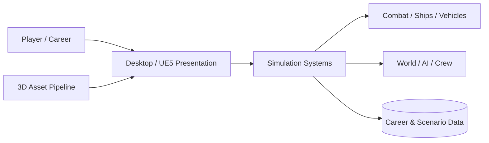
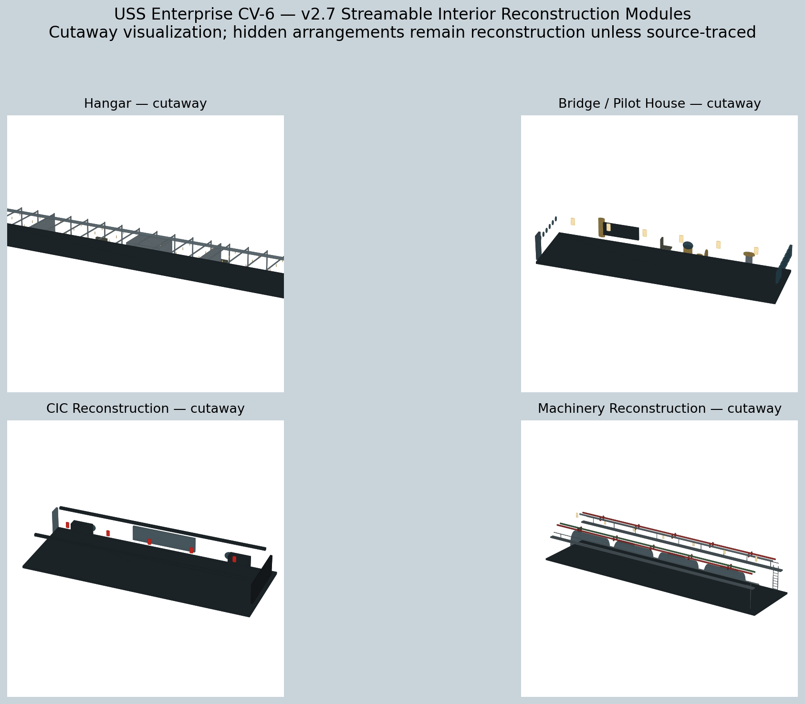
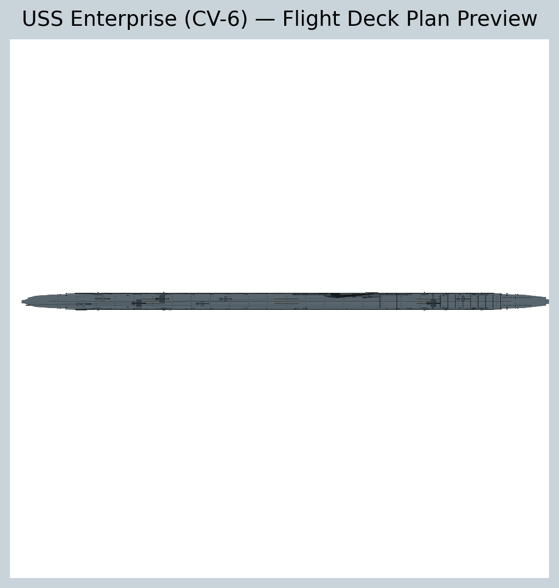

<!-- DPN-REPO-HERO:START -->

  

  
  
  

<!-- DPN-REPO-HERO:END -->

<!-- DPN-LIVE-STATUS:START -->

  
  
  
  

<!-- DPN-LIVE-STATUS:END -->

<!-- DPN-REPO-SHOWCASE:START -->

  <a href="https://github.com/DPN-Technology/DPN-War-Simulator/releases"><strong>Releases</strong></a>
  &nbsp;•&nbsp;
  <a href="https://github.com/DPN-Technology/DPN-War-Simulator/issues"><strong>Issues</strong></a>
  &nbsp;•&nbsp;
  <a href="https://github.com/DPN-Technology/DPN-War-Simulator/pulls"><strong>Pull Requests</strong></a>

<!-- DPN-REPO-SHOWCASE:END -->

<!-- DPN-REPO-DETAILS:START -->

## Product Architecture

## Feature Matrix

| Area | What this repository covers |
| --- | --- |
| **Simulation** | First-person, shipboard and large-scale war systems |
| **Naval / Vehicle** | Ship physics, survivability, air and ground operations |
| **Career** | Academy, crew, service record and historical progression |
| **Content Pipeline** | 3D assets, UE5 migration and historical references |

## Visual Evidence

<table>
<tr>
<td align="center"> USS Enterprise preview</td>
<td align="center"> Interior modules preview</td>
<td align="center"> Top profile</td>
</tr>
</table>

> Visuals above are repository-native assets or verified project captures already committed within the DPN organization. No synthetic runtime screenshot is presented as a real capture.

## Install & Run

| | |
| --- | --- |
| **Primary target** | Windows / UE5 |
| **Fast path** | Use `RUN_GAME.bat` for the current launcher or `OPEN_UE5_PROJECT.bat` for Unreal development. |
| **Setup reference** | [Open setup documentation](START_HERE.txt) |

## Security, Architecture & Release

| Resource | Purpose |
| --- | --- |
| [Security policy](SECURITY.md) | Vulnerability reporting, protected-data guidance and security expectations |
| [Architecture](docs/ARCHITECTURE.md) | System boundaries, major components and engineering model |
| [Release process](RELEASE_PROCESS.md) | How versioned releases are prepared and validated |
| [GitHub Releases](https://github.com/DPN-Technology/DPN-War-Simulator/releases) | Published versions and downloadable release artifacts |

> **Repository presentation rule:** status, release and security claims in this README should stay tied to repository evidence. Visual polish must not imply a capability is production-ready when the underlying project documentation says otherwise.

<!-- DPN-REPO-DETAILS:END -->

<!-- DPN-ECOSYSTEM:START -->

## DPN Ecosystem

**Category:** Simulation & Interactive

[**DPN Tool Die Simulator**](https://github.com/DPN-Technology/DPN-Tool-Die-Simulator) · [**MemeSpace**](https://github.com/DPN-Technology/MemeSpace) · [**DPN Website**](https://github.com/DPN-Technology/DPN-Website)

<strong>Explore the broader DPN Technology platform</strong>

| Control & Infrastructure | Business Operations | Development & AI | Simulation & Interactive |
| --- | --- | --- | --- |
| [DPN Operational Control](https://github.com/DPN-Technology/DPN-Operational-Control) | [DPN One](https://github.com/DPN-Technology/DPN-One) | [DPN AI](https://github.com/DPN-Technology/DPN-AI) | [DPN War Simulator](https://github.com/DPN-Technology/DPN-War-Simulator) |
| [DPN Executive Control System](https://github.com/DPN-Technology/DPN-Executive-Control-System) | [DPN Human Resources](https://github.com/DPN-Technology/DPN-Human-Resources-Software) | [Death the Developer](https://github.com/DPN-Technology/DPN-Death-the-Developer) | [Tool & Die Simulator](https://github.com/DPN-Technology/DPN-Tool-Die-Simulator) |
| [DPN WatchTower](https://github.com/DPN-Technology/DPN-Watch-Tower) | [DPN Workforce](https://github.com/DPN-Technology/DPN-Workforce-Time-Management-System) | [DPN Website](https://github.com/DPN-Technology/DPN-Website) | [MemeSpace](https://github.com/DPN-Technology/MemeSpace) |
| [DPN Network Mapper](https://github.com/DPN-Technology/DPN-Network-Mapper) | [DPN Service Desk](https://github.com/DPN-Technology/DPN-Service-Desk) | [DPN FiveM Resources](https://github.com/DPN-Technology/DPN-QB-FiveM-Scripts) | [DPN Aqua Labs](https://github.com/DPN-Technology/DPN-Aqua-Labs-Point-of-Sale-System) |

<!-- DPN-ECOSYSTEM:END -->

<h1 align="center">DPN War Simulator</h1>

<strong>Developed by DPN Technology</strong>

  
  
  
  
  

> **Release:** v2.7  
> **Focus:** Large-scale 3D war simulation · First-person gameplay · Ships · Vehicles · Open-world systems

[Overview](#overview) · [Development Priorities](#development-priorities) · [Architecture](docs/ARCHITECTURE.md) · [Roadmap](ROADMAP.md) · [Release Notes](RELEASE_NOTES.md) · [Security](SECURITY.md) · [Contributing](CONTRIBUTING.md)

## Overview

DPN War Simulator is DPN Technology's large-scale 3D war simulation project focused on immersive first-person gameplay, realistic vehicles and ships, seamless environments, combat systems, damage simulation, AI, and an expanding open world.

The project is being developed as a simulation platform rather than a collection of disconnected scenes. The long-term architecture is intended to support continuous traversal, interactive ship interiors, physical movement, vehicle systems, combat, crew/AI behavior, world simulation, and production-quality assets in one cohesive runtime.

## Development Priorities

- Realistic environments and production-quality 3D assets
- Seamless traversal through ships, decks, rooms, and world spaces
- Advanced ship and vehicle physics
- First-person interaction and combat systems
- AI, damage, crew, and world simulation
- Performance profiling and optimization
- Automated simulation tests and asset-pipeline validation
- Reproducible releases, CI, SBOMs, and supply-chain evidence

## Engineering & Validation

The repository includes automated GitHub Actions validation for Python compilation, simulation tests, and the 3D asset pipeline. The asset-pipeline job validates core dependencies such as NumPy, trimesh, Pillow, and Matplotlib by creating test geometry and rendered assets during CI.

Development changes should preserve testability and avoid committing runtime credentials, generated secrets, databases, or other machine-local state.

## Release v2.7

The current GitHub release is **v2.7**. Release automation publishes the source archive and supporting integrity/supply-chain artifacts, including release manifests, dependency inventory, checksums, and SBOM data.

## Project Documentation

Detailed project information is maintained in the repository documentation:

- [`docs/ARCHITECTURE.md`](docs/ARCHITECTURE.md) — system and gameplay architecture
- [`docs/README.md`](docs/README.md) — documentation index
- [`ROADMAP.md`](ROADMAP.md) — development roadmap
- [`RELEASE_NOTES.md`](RELEASE_NOTES.md) — release history and current release notes
- [`SECURITY.md`](SECURITY.md) — security reporting and project security expectations
- [`CONTRIBUTING.md`](CONTRIBUTING.md) — development contribution standards
- [`SUPPLY_CHAIN.md`](SUPPLY_CHAIN.md) — software supply-chain controls
- [`PORTFOLIO.md`](PORTFOLIO.md) — connected DPN Technology software portfolio

## Repository Standards

This project follows the broader DPN repository baseline: controlled releases, automated CI, issue/PR workflows, security documentation, architecture documentation, release history, supply-chain evidence, and product-specific branding.

---

<strong>DPN Technology</strong> We Develop what doesn't exist. We Pioneer what comes next. We Navigate the future.

