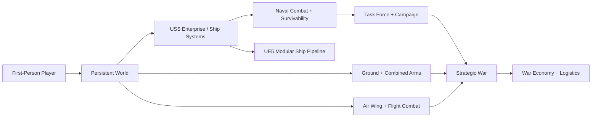
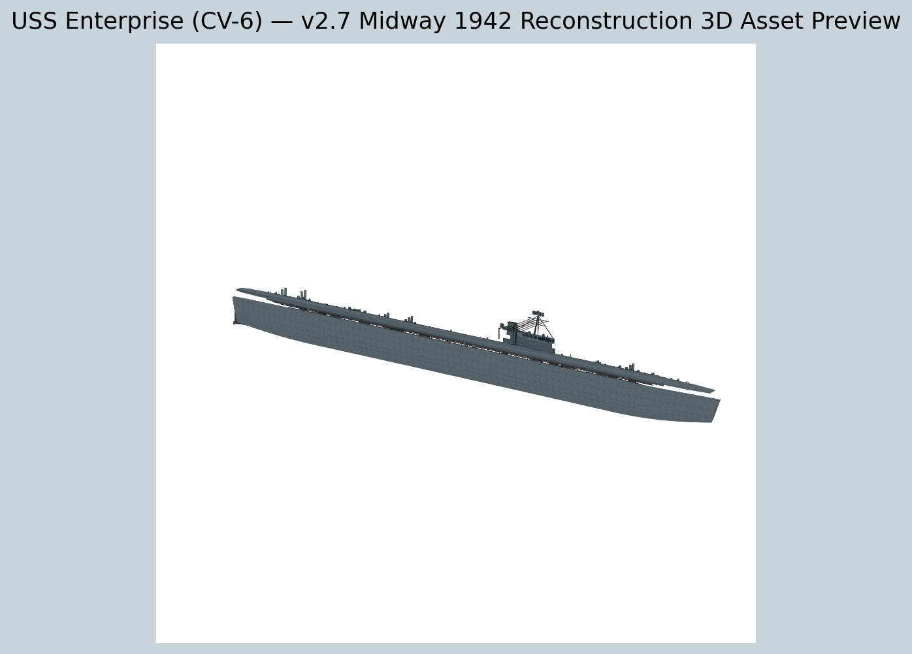

<h1 align="center">DPN War Simulator</h1>

<p align="center"><strong>Developed by DPN Technology</strong></p>

<p align="center">
  
  
  
  
</p>

> **Release:** v2.7  
> **Technology:** Python · 3D Asset Pipeline · Unreal Engine 5 C++

### Quick navigation
[Overview](#overview) · [Features](#major-capabilities) · [Architecture](#system-architecture) · [Installation](#installation--startup) · [Security](#security) · [Roadmap](ROADMAP.md) · [Documentation](#documentation)

## Overview
War Simulator is a long-term military simulation project intended to connect first-person service life, naval warfare, air operations, ground combat, logistics, command, and strategic war into one persistent simulation.

The project is being built in layers. The current executable fallback client is Python-based, while a parallel Unreal Engine 5 project and modular 3D asset pipeline are being developed to move the simulation toward a modern, seamless first-person 3D environment.

## Project Vision

War Simulator is designed around more than combat score. The underlying design tracks concepts such as:
- Mission accomplishment
- Survival
- Leadership
- Decision quality
- Discipline
- Logistics
- Qualifications
- Career progression
- Team coordination
- Persistent operational consequences

The broader target spans naval, land, and air operations with players serving in coordinated roles inside ships, aircraft, units, task forces, and strategic commands.

## Current Playable Foundation

The Python client remains the current executable fallback and contains the accumulated simulation stack from the earlier phases through v2.7.

Key characteristics include:
- First-person movement
- Persistent player/career state
- Seamless base and operational spaces
- Physical ship traversal
- Carrier-scale USS Enterprise environment
- Ship systems and damage-control interactions
- Naval combat and survivability
- Air-wing and flight operations
- Ground and combined-arms systems
- Task-force and campaign command
- Strategic warfare, economy, and logistics
- Qualifications tied to performance

The permanent input regression rule is:
- **D** = move/strafe right
- **F6** = Damage Control

## Simulation Systems

### First-Person & Seamless World
- First-person movement foundation
- Seamless training-base world
- Physical stations for operational systems
- Shipboard traversal
- Save migration across world/ship revisions
- Performance/quality modes
- Optional deep-systems HUD

### USS Enterprise (CV-6)
The current physical focus is a Midway-period 1942 reconstruction of USS Enterprise.

The reconstructed ship foundation includes:
- Full carrier-scale exterior envelope
- Flight deck
- Hangar
- Island and bridge spaces
- Engineering
- Lower-deck traversal
- Aircraft elevator points
- Operational equipment stations
- Damage mapping across the ship
- Period-inspired AA, crane, searchlight, mast, radar, and director cues

### Living Ship & Shipboard Systems
The simulation architecture includes concepts for:
- Bridge
- CIC
- Engineering
- Damage Control
- Hangar
- Flight Deck
- Machinery
- Power
- Fire
- Smoke
- Flooding
- Compartments
- Hatches and watertight doors
- Steering and propulsion
- Shipboard equipment state

### Ship Physics
The ship-physics layer provides a foundation for:
- Vessel movement
- Damage effects
- Physical-world interaction
- Flooding/survivability integration
- Future modern-renderer synchronization

### Naval Combat & Survivability
- Ship combat abstractions
- Damage and survivability modeling
- Task-force interaction
- Finite support resources
- Persistent consequences

### Command & Crew
- Command-watch concepts
- Crew/role progression
- Qualifications
- Leadership-oriented objectives
- Coordination between tactical and strategic systems

### Task Force & Campaign
- Task-force-level operations
- Campaign state
- Persistent operational formations
- Naval/air/land interaction
- Campaign consequences from tactical results

### Air Wing & Flight Operations
- Carrier Air Group concepts
- Flight operations
- Air-combat simulation
- Air support resources
- Persistent air-wing state

### Ground & Combined Arms
- Infantry/fireteam operations
- Orders and autonomous response
- Suppression, wounds, ammo, casualties, and medical concepts
- Combined-arms support decisions
- Battalion and land-warfare progression

### Strategic War
The strategic layer extends the tactical world into:
- Persistent front lines
- Sector control
- Operational formations
- Reconnaissance confidence
- Reinforcements
- Theater depots
- Infrastructure
- Strategic command

### War Economy
- National reserves
- Production
- Finished stockpiles
- Facilities
- Research
- Training
- Replacement personnel
- Transport throughput
- Allocation to theater, air, naval, and land forces

### Strategic Logistics
The logistics model is intentionally more than instant inventory transfer.

The chain can represent:

```text
National Production
      ↓
National Dispatch
      ↓
Transit Hub
      ↓
Downstream Dispatch
      ↓
Final Hub
      ↓
Operational Issue
      ↓
Theater / Land / Air / Fleet Recipient
```

The system includes route damage, bridge integrity, hub damage, capacity, delays, losses, escort effects, staged inventory, and persistent shipment state.

## USS Enterprise v2.7 Asset Pipeline

### Primary Assets
- `assets3d/Enterprise_CV6_1942_Midway_EDITABLE.glb`
- `assets3d/Enterprise_CV6_1942_Midway.glb`
- OBJ compatibility export
- Preview renders and manifest metadata

The editable exterior asset contains approximately:
- 251.4 m reconstructed overall bounds
- 1,498 named editable objects
- 24,629 vertices
- 43,314 triangles
- 55 batched runtime groups

### Streamable Exterior Modules
`assets3d/modules/` contains:
- Hull / Deck / Hangar
- Island
- Weapons / Fittings
- Deck Aircraft

### Streamable Interior Modules
`assets3d/interiors/` contains:
- Hangar interior
- Bridge / pilot house
- CIC reconstruction
- Engineering reconstruction

These interior spaces are reconstruction modules and are **not claimed to be exact June 1942 Enterprise-specific compartment plans**.

## Unreal Engine 5 Migration

The UE5 project is located at:

```text
ue5/WarSimulatorUE5/
```

Current UE5 foundations include:
- C++ first-person character
- Modular Enterprise actor
- Watertight door actor
- Compartment volume hooks
- Save-state bridge
- DX12 / Shader Model 6 target
- Nanite target
- Lumen GI/reflections
- Virtual Shadow Maps
- TSR
- Modular ship imports for exterior and interior sections

The source package is prepared for a local Unreal Engine 5 installation. A packaged UE5 Windows build is **not** claimed in this repository unless it has actually been compiled/cooked on a machine with UE5 installed.

## Historical Method

War Simulator separates historical references from gameplay or reconstruction assumptions.

Historical/reference data is stored under `historical_data/`, while project documentation explicitly identifies abstractions such as:
- Interior layouts without confirmed plans
- Training villages
- Unit names/compositions
- Economy values
- Logistics distances and coefficients
- Weapon/gameplay tuning
- Strategic map values

See:
- `HISTORICAL_SOURCES.md`
- `ENTERPRISE_1942_VISUAL_REFERENCE.md`
- `SPEC_TRACEABILITY.md`
- `ENTERPRISE_RECONSTRUCTION_V27.md`

## System Architecture



The diagram is a high-level map of the current repository architecture. Detailed implementation notes remain in the source and project documentation.

## Installation & Startup

### Test then run the current client
```bat
TEST_AND_RUN.bat
```

### Normal fallback launch
```text
START_WAR_SIMULATOR.vbs
```

### Build Windows fallback executable
```bat
BUILD_AND_RUN_WINDOWS_EXE.bat
```

## Unreal / 3D Tools

Open the reconstructed ship:
```bat
OPEN_ENTERPRISE_3D_MODEL.bat
```

Import Enterprise into UE5:
```bat
IMPORT_ENTERPRISE_UE5.bat
```

Open the Unreal project:
```bat
OPEN_UE5_PROJECT.bat
```

Build/package with a local UE5 install:
```bat
BUILD_UE5_WINDOWS.bat
```

## Repository Layout

```text
warsim/              Core Python simulation systems
historical_data/     Historical data and explicit simulation abstractions
assets3d/            Enterprise 3D assets, modules, interiors and textures
ue5/                 Unreal Engine 5 project and C++ source
tests/               Core, regression and GUI smoke tests
assets/              Application assets
*.md                 Phase-specific design and implementation documentation
```

## Testing

The project contains dedicated tests for:
- Core systems
- Enterprise
- Ship systems
- First-person 3D
- Open world
- Ship physics
- Naval combat
- Survivability
- Command
- Task force
- Campaign
- Air wing
- Flight combat
- Ground operations
- Combined arms
- Land warfare
- Strategic war
- Economy
- Logistics
- Enterprise realism
- Enterprise reconstruction
- Historical data boundaries

Version-specific GUI smoke tests are also retained to protect against regressions introduced as the simulation expands.

## Current Status

War Simulator v2.7 is a hybrid development state:
1. The Python client is the current playable simulation fallback.
2. The Enterprise asset pipeline has moved to modular GLB assets.
3. Unreal Engine 5 source has been scaffolded for the next rendering/physical-world phase.
4. Historical accuracy work and gameplay abstractions remain explicitly separated.
5. The project is still under active development and should not be represented as a finished commercial simulator.


## Visual Preview



## Project Status

| Item | Current State |
| --- | --- |
| Release | **v2.7** |
| Development | **Active** |
| Repository visibility | **Private** |
| Publisher | **DPN Technology** |
| Primary stack | Python · 3D Asset Pipeline · Unreal Engine 5 C++ |
| Roadmap | [View ROADMAP.md](ROADMAP.md) |

## Documentation

- [`PLAYTEST_GUIDE.md`](PLAYTEST_GUIDE.md)
- [`SPEC_TRACEABILITY.md`](SPEC_TRACEABILITY.md)
- [`HISTORICAL_SOURCES.md`](HISTORICAL_SOURCES.md)
- [`ENTERPRISE_RECONSTRUCTION_V27.md`](ENTERPRISE_RECONSTRUCTION_V27.md)
- [`UE5_SHIP_PIPELINE_V27.md`](UE5_SHIP_PIPELINE_V27.md)
- [`CHANGELOG.md`](CHANGELOG.md)

## Development Standards

- Keep live credentials, keys, databases, backups, and private operational data out of Git.
- Update version metadata and documentation together.
- Add or update regression tests when fixing production defects.
- Preserve compatibility code until replacement behavior is verified.
- Document demo/reconstruction behavior separately from production/historical claims.

---

<p align="center"><strong>DPN Technology</strong><br>Developing connected systems, software, operations platforms, and simulation technology.</p>
