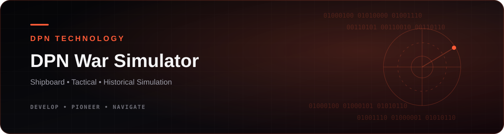
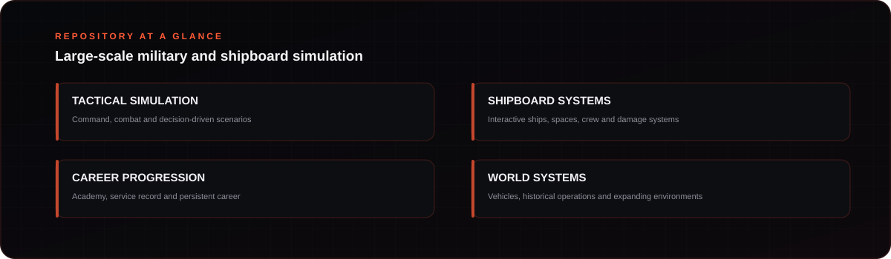

<!-- DPN-REPO-HERO:START -->

  

  
  
  

<!-- DPN-REPO-HERO:END -->

<!-- DPN-REPO-SHOWCASE:START -->

  <a href="https://github.com/DPN-Technology/DPN-War-Simulator/releases"><strong>Releases</strong></a>
  &nbsp;•&nbsp;
  <a href="https://github.com/DPN-Technology/DPN-War-Simulator/issues"><strong>Issues</strong></a>
  &nbsp;•&nbsp;
  <a href="https://github.com/DPN-Technology/DPN-War-Simulator/pulls"><strong>Pull Requests</strong></a>

<!-- DPN-REPO-SHOWCASE:END -->

<h1 align="center">DPN War Simulator</h1>

<strong>Developed by DPN Technology</strong>

  
  
  
  
  

> **Release:** v2.7  
> **Focus:** Large-scale 3D war simulation · First-person gameplay · Ships · Vehicles · Open-world systems

[Overview](#overview) · [Development Priorities](#development-priorities) · [Architecture](docs/ARCHITECTURE.md) · [Roadmap](ROADMAP.md) · [Release Notes](RELEASE_NOTES.md) · [Security](SECURITY.md) · [Contributing](CONTRIBUTING.md)

## Overview

DPN War Simulator is DPN Technology's large-scale 3D war simulation project focused on immersive first-person gameplay, realistic vehicles and ships, seamless environments, combat systems, damage simulation, AI, and an expanding open world.

The project is being developed as a simulation platform rather than a collection of disconnected scenes. The long-term architecture is intended to support continuous traversal, interactive ship interiors, physical movement, vehicle systems, combat, crew/AI behavior, world simulation, and production-quality assets in one cohesive runtime.

## Development Priorities

- Realistic environments and production-quality 3D assets
- Seamless traversal through ships, decks, rooms, and world spaces
- Advanced ship and vehicle physics
- First-person interaction and combat systems
- AI, damage, crew, and world simulation
- Performance profiling and optimization
- Automated simulation tests and asset-pipeline validation
- Reproducible releases, CI, SBOMs, and supply-chain evidence

## Engineering & Validation

The repository includes automated GitHub Actions validation for Python compilation, simulation tests, and the 3D asset pipeline. The asset-pipeline job validates core dependencies such as NumPy, trimesh, Pillow, and Matplotlib by creating test geometry and rendered assets during CI.

Development changes should preserve testability and avoid committing runtime credentials, generated secrets, databases, or other machine-local state.

## Release v2.7

The current GitHub release is **v2.7**. Release automation publishes the source archive and supporting integrity/supply-chain artifacts, including release manifests, dependency inventory, checksums, and SBOM data.

## Project Documentation

Detailed project information is maintained in the repository documentation:

- [`docs/ARCHITECTURE.md`](docs/ARCHITECTURE.md) — system and gameplay architecture
- [`docs/README.md`](docs/README.md) — documentation index
- [`ROADMAP.md`](ROADMAP.md) — development roadmap
- [`RELEASE_NOTES.md`](RELEASE_NOTES.md) — release history and current release notes
- [`SECURITY.md`](SECURITY.md) — security reporting and project security expectations
- [`CONTRIBUTING.md`](CONTRIBUTING.md) — development contribution standards
- [`SUPPLY_CHAIN.md`](SUPPLY_CHAIN.md) — software supply-chain controls
- [`PORTFOLIO.md`](PORTFOLIO.md) — connected DPN Technology software portfolio

## Repository Standards

This project follows the broader DPN repository baseline: controlled releases, automated CI, issue/PR workflows, security documentation, architecture documentation, release history, supply-chain evidence, and product-specific branding.

---

<strong>DPN Technology</strong> We Develop what doesn't exist. We Pioneer what comes next. We Navigate the future.

