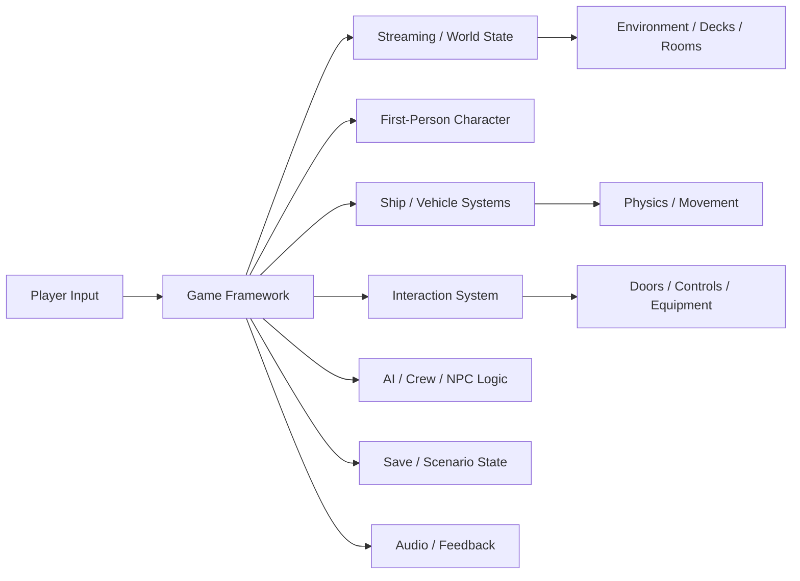

# DPN War Simulator Architecture

## Purpose

DPN War Simulator is an immersive military simulation project intended to support large continuous environments, first-person interaction, realistic ship/vehicle behavior, interactive systems, and progressively higher-fidelity gameplay.

## High-level architecture

## Core layers

### Game framework
Owns game-state transitions, scenario lifecycle, common subsystem registration, and high-level orchestration. Individual features should not depend directly on unrelated subsystems when an interface/event can be used instead.

### Player and input
Input mapping should be centralized so gameplay keys do not accidentally trigger debug/editor/console behavior. First-person locomotion, camera, interaction, and vehicle controls should be testable independently.

### World and streaming
Large environments should be divided into manageable streaming/visibility regions without presenting unnecessary loading interruptions to the player. Asset density, collision, lighting, and simulation cost must be budgeted together.

### Ship and vehicle systems
Movement should separate player input, propulsion/steering commands, physics state, visual feedback, and damage/system effects. Realistic behavior should remain tunable without rewriting the underlying control model.

### Interaction system
Doors, switches, equipment, stations, ladders, hatches, controls, and other interactables should use a shared interface with clear range, state, authority, and feedback rules.

### AI and crew
AI should use explicit goals/tasks and avoid running expensive perception or pathfinding work every frame when event-driven or scheduled updates are sufficient.

## Performance principles

- Profile before increasing world detail.
- Use appropriate level-of-detail, culling, instancing, streaming, and collision complexity.
- Avoid unnecessary per-frame work.
- Separate visual fidelity from simulation fidelity so each can be tuned independently.
- Keep debug systems disabled or gated in normal builds.
- Test representative worst-case locations and scenarios.

## Reliability principles

- Inputs should be deterministic and conflict-free.
- Physics changes should have repeatable test scenarios.
- Save/scenario state should be versioned when formats change.
- Interactions must handle invalid or destroyed targets gracefully.
- Large-world streaming must not duplicate critical gameplay actors.

## Architecture change checklist

Before merging structural changes, verify input mappings, performance, physics stability, streaming behavior, interaction compatibility, save/scenario compatibility, regression tests, build reproducibility, and documentation.
